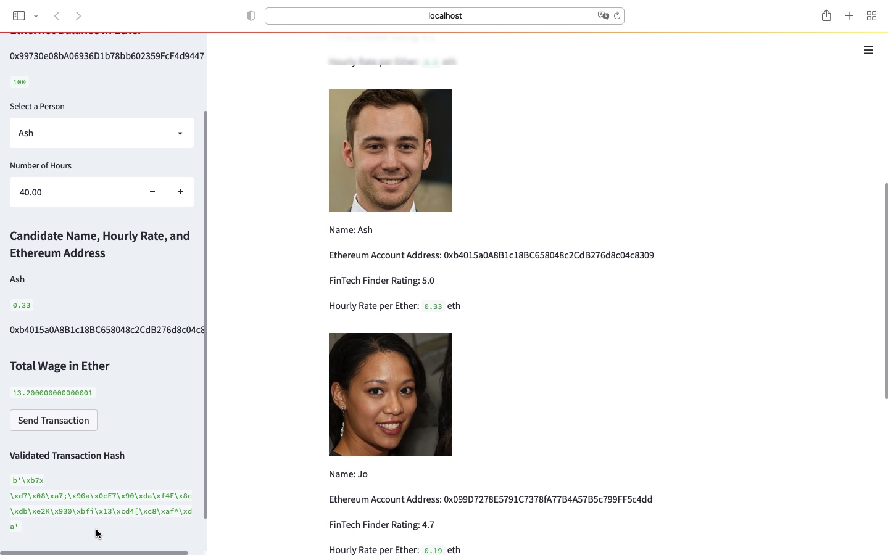
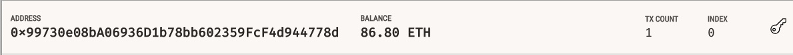
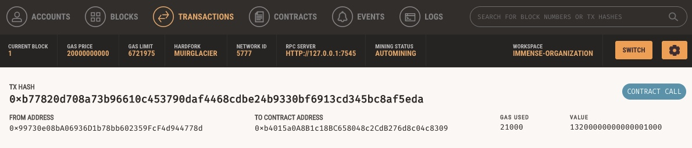
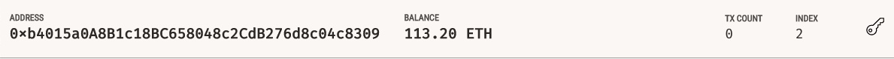

## Cryptocurrency Wallet

### Background

You work at a startup that is building a new and disruptive platform called Fintech Finder. Fintech Finder is an application that its customers can use to find fintech professionals from among a list of candidates, hire them, and pay them. As Fintech Finder’s lead developer, you have been tasked with integrating the Ethereum blockchain network into the application in order to enable your customers to instantly pay the fintech professionals whom they hire with cryptocurrency.

In this Challenge, you will complete the code that enables your customers to send cryptocurrency payments to fintech professionals. To develop the code and test it out, you will assume the perspective of a Fintech Finder customer who is using the application to find a fintech professional and pay them for their work.

### What You're Creating
To complete this Challenge, you will use two Python files, both of which are contained in the starter folder.

The first file that you will use is called fintech_finder.py. It contains the code associated with the web interface of your application. The code included in this file is compatible with the Streamlit library. You will write all of your code for this Challenge in this file.

The second file that you will use is called crypto_wallet.py. This file contains the Ethereum transaction functions that you have created throughout this module’s lessons. By using import statements, you will integrate the crypto_wallet.py Python script into the Fintech Finder interface program that is found in the fintech_finder.py file.

Integrating these two files will allow you to automate the tasks associated with generating a digital wallet, accessing Ethereum account balances, and signing and sending transactions via a personal Ethereum blockchain called Ganache.

Specifically, you will assume the perspective of a Fintech Finder customer in order to do the following:

Generate a new Ethereum account instance by using the mnemonic seed phrase provided by Ganache.

Fetch and display the account balance associated with your Ethereum account address.

Calculate the total value of an Ethereum transaction, including the gas estimate, that pays a Fintech Finder candidate for their work.

Digitally sign a transaction that pays a Fintech Finder candidate, and send this transaction to the Ganache blockchain.

Review the transaction hash code associated with the validated blockchain transaction.

Once you receive the transaction’s hash code, you will navigate to the Transactions section of Ganache to review the blockchain transaction details. To confirm that you have successfully created the transaction, you will save screenshots to the README.md file of your GitHub repository for this Challenge assignment.

### Technologies & Libraries
This project leverages python3 with the following packages:

* [dotenv](https://www.npmjs.com/package/dotenv) - For accessing hidden .env file.

* [streamlit](https://docs.streamlit.io/library/get-started/installation) - For a blockchain interface. 

* [bip44](https://pypi.org/project/bip44/) - For simple Python bip44 implementation.

* [web3](https://pypi.org/project/web3/) - A Python library for interacting with Ethereum. 

* [dataclassses](https://pypi.org/project/dataclasses/) - For Python class data.  

* [typing](https://pypi.org/project/typing/) - Typing defines a standard notation for Python function and variable type annotations. 

## Installation Guide

* pip install dotenv
* pip install streamlit
* pip install dataclasses
* pip install web3
* pip install typing
* pip install bip44

---

### Steps Involved

The steps for this challenge are broken out into the following sections:

* Write the code and Launch the Fintech Finder Application on Streamlit
* Sign and Execute a Payment Transaction
* Inspect the Transaction on Ganache

#### Step 1: Write the code and Launch the Fintech Finder Application on Streamlit

In this section, you'll import several functions from the `crypto_wallet.py` script into the file `fintech_finder.py`, which contains code for Fintech Finder’s customer interface, in order to add wallet operations to the application. For this section, you will assume the perspective of a Fintech Finder customer (i.e., you’ll provide your Ethereum wallet and account information to the application).

Once the code is complete you run the 'fintech_finder.py' on streamlit

Below is the screen shot of the streamlit interface

#### Step 2: Sign and Execute a Payment Transaction

Fintech Finder customers will select a fintech professional from the application interface’s drop-down menu, and then input the amount of time for which they’ll hire the worker. Once you click on 'Send Transaction' you will see the `transaction_hash`  displayed on the application’s web interface.

Below is the screen shot of a signed transaction where we have selected Ash for 40 Hours, which turns out to a total of 13.20 Ether

#### Step 3: Inspect the Transaction on Ganache

Verify whether the transaction is recorded on Ganache

a) Screenshot of the client's address balance and history on Ganache. 

b) Screenshot of the transaction details on Ganache. 

c) Screenshot of the recipient’s address balance and history from your Ganache application. 

---

## License

## Copyright © 2022# Blockchain-Wallets
## Gregg R. Saldutti
