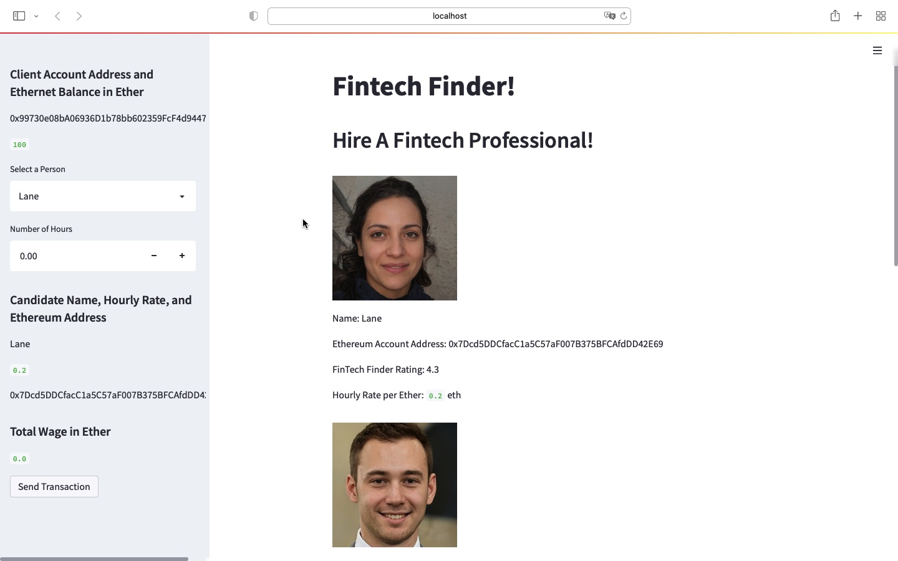

## Cryptocurrency Wallet

### Background

You work at a startup that is building a new and disruptive platform called Fintech Finder. Fintech Finder is an application that its customers can use to find fintech professionals from among a list of candidates, hire them, and pay them. As Fintech Finder’s lead developer, you have been tasked with integrating the Ethereum blockchain network into the application in order to enable your customers to instantly pay the fintech professionals whom they hire with cryptocurrency.

### Technologies & Libraries
This project uses the following key technologies and libraries: 
* streamlit
* dataclasses
* web3
* bip44
* Ganache

### Steps Involved

The steps for this challenge are broken out into the following sections:

* Write the code and Launch the Fintech Finder Application on Streamlit
* Sign and Execute a Payment Transaction
* Inspect the Transaction on Ganache

#### Step 1: Write the code and Launch the Fintech Finder Application on Streamlit

In this section, you'll import several functions from the `crypto_wallet.py` script into the file `fintech_finder.py`, which contains code for Fintech Finder’s customer interface, in order to add wallet operations to the application. For this section, you will assume the perspective of a Fintech Finder customer (i.e., you’ll provide your Ethereum wallet and account information to the application).

Once the code is complete you run the 'fintech_finder.py' on streamlit

Below is the screen shot of the streamlit interface

#### Step 2: Sign and Execute a Payment Transaction

Fintech Finder customers will select a fintech professional from the application interface’s drop-down menu, and then input the amount of time for which they’ll hire the worker. Once you click on 'Send Transaction' you will see the `transaction_hash`  displayed on the application’s web interface.

Below is the screen shot of a signed transaction where we have selected Ash for 40 Hours, which turns out to a total of 13.20 Ether

#### Step 3: Inspect the Transaction on Ganache

Verify whether the transaction is recorded on Ganache

a) Screenshot of the client's address balance and history on Ganache. 

b) Screenshot of the transaction details on Ganache. 

c) Screenshot of the recipient’s address balance and history from your Ganache application. 

---

## License

Copyright © 2022# Blockchain-Wallets
